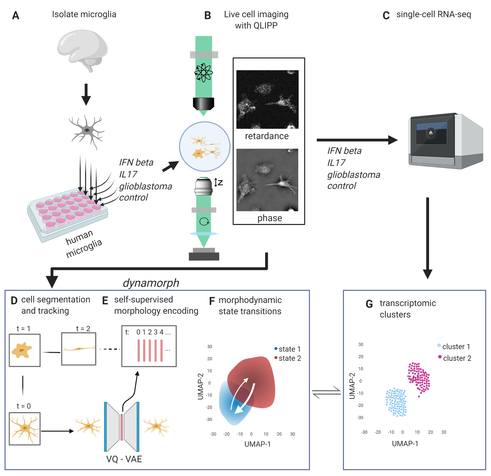
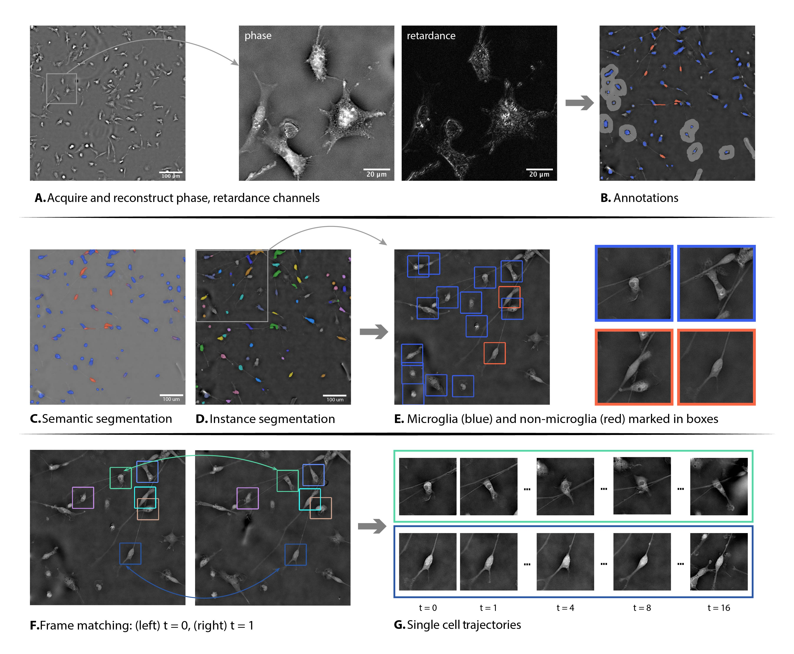

# DynaMorph

This is a repo storing codes and scripts for **DynaMorph: learning morphodynamic states of human cells with live imaging and sc-RNAseq**, manuscript of this work can be accessed [here](https://www.biorxiv.org/content/10.1101/2020.07.20.213074v1). Analyzing pipeline of DynaMorph and structure of this repo are introduced below.



### Table of contents:

- [Requirements](#requirements)
- [Getting Started](#getting-started)
- [DynaMorph Pipeline](#dynamorph-pipeline)
  - [Label-free Imaging](#label-free-imaging)
  - [Cell Segmentation and Tracking](#cell-segmentation-and-tracking)
  - [Latent Representations of Morphology](#latent-representations-of-morphology)
- [Usage](#usage)
- [Citing DynaMorph](#citing-dynamorph)

## Requirements

DynaMorph is developed and tested under Python 3.7, packages below are required.

- [imageio](https://imageio.github.io/)
- [Keras](https://keras.io/)
- [Matplotlib](https://matplotlib.org/)
- [NumPy](https://numpy.org/)
- [OpenCV](https://opencv.org/about/)
- [PyTorch](https://pytorch.org/)
- [SciPy](https://www.scipy.org/)
- [scikit-learn](https://scikit-learn.org/)
- [segmentation-models](https://github.com/qubvel/segmentation_models)
  - DynaMorph requires segmentation-models v0.2.1
- [TensorFlow](https://www.tensorflow.org/)
- [tifffile](https://pypi.org/project/tifffile/)

## Getting Started

DynaMorph utilizes a broad set of deep learning and machine learning tools to analyze cell imaging data, [pipeline](https://github.com/czbiohub/dynamorph/tree/master/pipeline) folder contains wrapper methods for easy access to the functionalities of DynaMorph. We also maintained some example scripts `run_preproc.py`, `run_segmentation.py`, `run_patch.py` and `run_VAE.py` to facilitate parallelization of data processing. Check [section](#cell-segmentation-and-tracking) below for functionalities this repo provides.

## DynaMorph Pipeline

DynaMorph starts with raw image files from cell imaging experiments and sequentially applies a set of segmentation and encoding tools. Below we briefly introduced the main processing steps.

### Label-free Imaging
(for pipeline, can use data acquired from any microscopy source -- file format as .tif)
(in dynamorph paper, we use phase and retardance)
(collect polarization-resolved label-free images using method in <reference to virtual staining paper> )

### Cell Segmentation and Tracking



Scripts under `NNsegmentation` folder contain codes for U-Net based cell segmentation model. `NNsegmentation/run.py` provides an example on the model training procedure. Usage of the segmentation model in the whole pipeline can be found in `pipeline/segmentation.py`.

Instance segmentation in this work is based on clustering, related methods can be found in `SingleCellPatch/extract_patches.py`. Following cell tracking methods can be found in `SingleCellPatch/generate_trajectories.py`.

To generate segmentation and tracking from scratch, follow steps below:

##### <a name="step1"></a> 1. (optional) prepare training images and labels

##### <a name="step2"></a> 2. (optional) train a classifier, see scripts in `NNsegmentation/run.py`

##### <a name="step3"></a> 3. prepare inputs as 4-D numpy arrays of shape (n<sub>time frames</sub>, height, width, n<sub>channels</sub>), see method `pipeline.preprocess.write_raw_to_npy` for an example

##### <a name="step4"></a> 4. apply trained model for semantic segmentation, see method `pipeline.segmentation.segmentation` or `run_segmentation.py` 

##### <a name="step5"></a> 5. use predicted class probabilities for instance segmentation, see method `pipeline.segmentation.instance_segmentation` or `run_segmentation.py` 

##### <a name="step6"></a> 6. connect static cell frames to trajectories, see method `pipeline.patch_VAE.build_trajectories` or `run_patch.py` 

### Latent Representations of Morphology
DynaMorph uses VQ-VAE to encode and reconstruct cell image patches, from which latent vectors are used as morphology descriptor. Codes for building and training VAE models are stored in `HiddenStateExtractor/vq_vae.py`.

To extract single cell patches and employ morphology encoding, follow steps below:

##### <a name="step7"></a> 7. extract cell patches based on instance segmentation, see method `pipeline.patch_VAE.extract_patches` or `run_patch.py` 

##### <a name="step8"></a> 8. (optional) train a VAE for cell patch reconstruction, see the [main block](https://github.com/czbiohub/dynamorph/blob/8965b5d7b21895d95d548cc3ef6c1a397cee8255/HiddenStateExtractor/vq_vae.py#L1041) of `HiddenStateExtractor/vq_vae.py` for reference.

##### <a name="step9"></a> 9. assemble cell patches generate from step 7 to model-compatible datasets, see method `pipeline.patch_VAE.assemble_VAE` or `run_VAE.py`

##### <a name="step10"></a> 10. apply trained VAE models on cell patches, see method `pipeline.patch_VAE.process_VAE` or `run_VAE.py` 

## Usage

The dataset accopanying this repository is large and currently available upon request for demonstration. 

Example scripts `run_preproc.py`, `run_segmentation.py`, `run_patch.py` and `run_VAE.py` provide command line interface, for detailed usages please check by using the `-h` option. 

To run the dynamorph pipeline, data should first be assembled into 4-D numpy arrays ([step 3](#step3)). Assume raw data (named as `$SITE_NAMES.npy`) are saved under `$RAW_PATH`, and intermediate data will be saved under supplementary folder `$SUPP_PATH`. Related model weights are respectively located at `$UNET_WEIGHT_PATH`, `$VQVAE_WEIGHT_PATH` and `$PCA_WEIGHT_PATH`, below is a simple sequence of commands that could run dynamorph.

Semantic segmentation ([step 4](#step4)) and instance segmentation ([step 5](#step5))):

	python run_segmentation.py -r $RAW_PATH -s $SUPP_PATH -m segmentation -f $SITE_NAMES -w $UNET_WEIGHT_PATH
	python run_segmentation.py -r $RAW_PATH -s $SUPP_PATH -m instance_segmentation -f $SITE_NAMES

Extract patches from segmentation results ([step 7](#step7)), then connect them into trajectories ([step 6](#step6)):

	python run_patch.py -r $RAW_PATH -s $SUPP_PATH -m extract_patches -f $SITE_NAMES
	python run_patch.py -r $RAW_PATH -s $SUPP_PATH -m build_trajectories -f $SITE_NAMES

Initiate a trained VQ-VAE model and encode cell image patches into morphology descriptors ([step 9](#step9) and [10](#step10)):

	python run_VAE.py -r $RAW_PATH -s $SUPP_PATH -m assemble -f $SITE_NAMES
	python run_VAE.py -r $RAW_PATH -s $SUPP_PATH -m process -f $SITE_NAMES -w $VQVAE_WEIGHT_PATH
	python run_VAE.py -r $RAW_PATH -s $SUPP_PATH -m pca -f $SITE_NAMES -w $PCA_WEIGHT_PATH

## Citing DynaMorph

To cite DynaMorph, please use the bibtex entry below:

```
@article{wu2020dynamorph,
  title={DynaMorph: learning morphodynamic states of human cells with live imaging and sc-RNAseq},
  author={Wu, Zhenqin and Chhun, Bryant B and Schmunk, Galina and Kim, Chang and Yeh, Li-Hao and Nowakowski, Tomasz J and Zou, James and Mehta, Shalin B},
  journal={bioRxiv},
  year={2020},
  publisher={Cold Spring Harbor Laboratory}
}
```

## Contact Us

If you have any questions regarding this work or codes in this repo, feel free to raise an issue or reach out to us through:
- Zhenqin Wu <zqwu@stanford.edu>
- Bryant Chhun <bryant.chhun@czbiohub.org>
- Shalin Mehta <shalin.mehta@czbiohub.org> 
